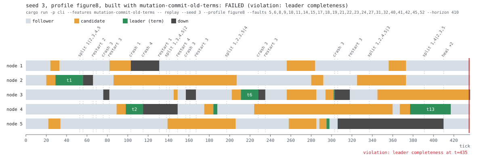

# raftsim

[](https://github.com/TedT002/Raft_sim/actions/workflows/ci.yml)

A Raft consensus implementation built together with a deterministic simulation test harness,
designed so that any run can be replayed exactly from a single seed (given the same configuration,
pinned toolchain and `Cargo.lock`).

## Status

Phases 0–5 are complete, and Phase 6 (optional extensions) is under way. A leader replicates client
commands with consistency-checked `AppendEntries`, starts every term with a no-op entry and commits
only entries of its own term by counting replicas (§5.4.2, the Figure 8 trap); followers answer
clients with `NotLeader` and a hint, and client sessions make retried requests take effect at most
once (§8). Reads can skip the log: a leader answers them after confirming its leadership with a
majority (ReadIndex, §6.4 of the Raft thesis). Logs can be compacted into state machine snapshots,
and a leader sends its snapshot to a follower that needs entries it no longer has (§7, Figure 13).
`raftsim fuzz` runs seeded chaos scenarios (crashes,
restarts, partitions, message loss, duplication and reordering, a disk that loses unsynced writes,
clients that retry and lose replies). It checks all five safety properties of Figure 3 after every
simulated event and the linearizability of the client history at the end of every run, and it
shrinks a failing scenario to a small one that `raftsim replay` reproduces exactly and can draw as
a timeline. Every push fuzzes 4000 seeds and proves that eleven deliberately planted bugs are still
caught.

## Quick start

```
# 1000 chaos scenarios on 8 threads; a failing seed is printed with a one-line replay command
cargo run --release -p cli -- fuzz --seeds 0..1000 --threads 8

# a profile that hunts for Figure 8 style bugs: one entry per AppendEntries, leaders crash often
cargo run --release -p cli -- fuzz --seeds 0..1000 --threads 8 --profile figure8

# most reads skip the log (ReadIndex) while leaders crash or get isolated and 1% of the messages
# take a long-tail delay of up to 120 ticks, mostly beyond the election timeouts
cargo run --release -p cli -- fuzz --seeds 0..1000 --threads 8 --profile reads

# every node snapshots its state machine and compacts its log every 16 entries
cargo run --release -p cli -- fuzz --seeds 0..1000 --threads 8 --profile snapshots

# replay one seed exactly: the fault schedule, every event and the final state of every node
cargo run --release -p cli -- replay --seed 42 --trace | less

# draw the same run as an SVG timeline (roles, terms, crashes, partitions, the violation);
# --window zooms into a range of ticks and adds every message delivered in it
cargo run --release -p cli -- replay --seed 42 --svg run.svg
cargo run --release -p cli -- replay --seed 42 --svg zoom.svg --window 100..200
```

Exit codes: 0 when every run passes, 1 when a run fails, 2 for invalid arguments (including a
fault index that the seed's schedule does not have, or a drawing window that starts after the run
ended), 3 when the tool itself fails (it cannot write its output or the SVG file, or start a worker
thread). `--shrink` shrinks the first 10 failing seeds.

## Why

Consensus bugs hide in timing and fault interleavings that are hard to reproduce with real clocks,
threads and sockets. `raftsim` simulates the network, the clock, the disk, crashes and randomness
instead, so that a single `u64` seed deterministically replays an entire run, including injected
message loss, delay, reordering, duplication, partitions, node crashes and lost disk writes. The
approach follows the deterministic simulation testing style popularized by FoundationDB and
TigerBeetle.

## Architecture

```
                 seed
                   │
                   ▼
           Scenario::generate ───► timed fault schedule: crash, crash the leader, restart,
                   │               partition, heal, change the loss rate
                   ▼
┌──────────────────────────────── Simulation (sim) ────────────────────────────────┐
│ event queue ordered by (time, seq) · virtual clock · FNV-1a trace hash           │
│                                                                                  │
│ ClientDriver ── request ──► RaftCluster ── Input ───► raft-core Node             │
│ (retries, lost replies)     (KV stores) ◄── Output ── step(), sans-IO            │
│                                                                                  │
│ SimNetwork: loss, duplication, delay and reordering, partitions, long tails      │
│ SimDisk: writes pending until fsync, lost on a crash                             │
└───────┬──────────────────────────────────────────────────────────┬───────────────┘
        │ client history, at the end                               │ after every event
        ▼                                                          ▼
  checker: linearizability                              checker: the five safety
  (Wing & Gong, split per key)                          properties of Figure 3, plus
                                                        write-time checks in sim
```

The Raft state machine is sans-IO: it has one entry point and returns a list of effects for the host
to execute, instead of performing any I/O itself.

```rust
pub fn step(&mut self, input: Input) -> Vec<Output>
```

Output order is semantic: the host must execute a step's outputs in order, and an `Output::Persist`
must be durable (written and fsynced) before any later output of the same step is executed. This is
how the core honors Raft's rule that `currentTerm`, `votedFor` and `log[]` are updated on stable
storage before responding to RPCs (Figure 2 of the paper). A `Persist` carries only the change (the
term and vote, plus the log suffix to replace), the way a real node appends to a log file; after a
crash the host hands the full persistent state back to the core.

The simulator is protocol-agnostic: it drives any node with the same sans-IO shape
(`SimNode::step(NodeInput) -> Vec<NodeOutput>`), and Raft is plugged in through an adapter
(`RaftCluster`) that checks invariants after every event. Events are ordered by `(time, seq)`, so
simultaneous events run in insertion order; every component draws from its own ChaCha8 stream
derived from one master seed; and every processed event is folded into an FNV-1a trace hash, so two
runs with the same seed produce byte-identical traces. Partitions follow a "cut cable" model: a
message is delivered only if its endpoints stayed connected for its whole flight, so messages sent
during a partition never arrive, and messages in flight across a cut are lost even if the partition
heals before they are due. A crashed node keeps only its disk: it gets no ticks, messages arriving
while it is down are dropped, and a restart rebuilds it from what it persisted. The simulated disk
keeps every write pending until its fsync completes a few ticks later, and the simulator holds back
the messages and state machine applications that follow a write until the write is durable. A crash
loses pending writes (or, at random, lets a prefix of them land), just as on real hardware. A
message emitted before the write it depends on cannot be held back, and only an unlucky crash would
expose it, so the Raft adapter flags such an output order in the step that produces it.

Invariants are checked after every simulated event, not only at the end of a run, so a transient
violation cannot hide. All five safety properties of Figure 3 are checked by independent oracles
that never see `raft-core`'s types: Election Safety, Leader Append-Only, Log Matching, Leader
Completeness and State Machine Safety. The log oracles (Log Matching and Leader Completeness) judge
what is durable rather than what is in memory: a change that a crash wipes out before its fsync
never left the node, so recording it would describe a history that never happened (a single-node
cluster, for instance, elects itself and advances its commit index before either reaches its disk).
Leadership and what a leader does to its own log are judged in memory, at the moment a write is
issued, so a leader that corrupts its log and steps down before the write is durable is still
caught; a crash makes the Append-Only oracle forget the log snapshots of a node's leaderships
(Election Safety keeps its record), because only a node whose term never became durable can win the
same term again. Cheaper checks also look at memory when a write is issued: every live node's memory
must match what it wrote, so a state change that was not persisted is caught at once instead of
waiting for an unlucky crash; a step must persist before it sends or applies anything; and no node
may rewrite its log at or below the commit index the checker has seen for it.

Clients reach nodes directly (not through the simulated network), but a seeded fraction of replies
is lost, so a committed request often goes unanswered and is retried under the same `(client, seq)`.
The key-value state machine keeps the last sequence number and result of every client session and
answers a duplicate from the session instead of applying it again (§8). Operations are `Put`, `Get`,
`Delete` and `Append`; a `Get` either goes through the log or skips it (below). `Append` is not
idempotent, so a request applied
twice is visible to a later read, which is exactly what the linearizability checker looks for. The
history records the first call and the first reply of every operation; an operation whose client
gave up is indeterminate (it may or may not have taken effect), and one whose attempts were all
rejected is known to have failed and is left out. The checker follows Wing & Gong's search with
Lowe's just-in-time linearization and memoization, splits the history per key (P-compositionality)
and skips indeterminate writes whose values no read ever saw, which cannot change the verdict.

A read that skips the log follows the ReadIndex protocol of the Raft thesis (§6.4). The leader
believes it is the leader, but a newer leader may have been elected behind a partition and may have
completed writes since. So the leader starts a new confirmation round (`Probe`) after the read
arrives and answers only when a majority has acknowledged a round at least that recent, once it has
committed an entry of its own term (so that its commit index covers every completed write) and once
its state machine has applied up to that commit index. Rounds are numbered and a follower echoes the
number only for a probe of its current term, so a delayed acknowledgement of an older round, or of
a round of an earlier term, cannot confirm a newer read. A leader that steps down rejects its
pending reads with `NotLeader`. Probes are separate messages rather than a field of `AppendEntries`,
so runs without such reads are unchanged, byte for byte, down to their trace hashes.

Log compaction follows §7 and Figure 13 of the paper. The host decides when to take a snapshot (the
core never sees the state machine) and hands the core its state machine's encoding at the index it
has applied; the core drops that prefix of its log and persists the snapshot. A leader that no
longer has the entries a follower needs sends `InstallSnapshot` instead of `AppendEntries`; the
follower keeps the part of its log that matches the snapshot's last entry, discards the rest,
persists the snapshot and replaces its state machine, and a node that restarts boots from the
snapshot on its disk. The state machine's snapshot includes the client sessions, or a replica built
from it would apply a retried request twice. The oracles treat a compacted prefix as covered by its
snapshot, and the simulator checks the snapshots themselves when they are used: with compaction
on, every replica's state machine after applying an index, and the state machine rebuilt from every
snapshot that a node installs from its leader or loads from its disk at that index, must equal the
state the first replica had there. Snapshot-free runs are unchanged byte for byte.

A chaos scenario is generated before it is executed: the seed's scenario stream yields an explicit,
timed list of fault intents (crash an up node, crash the leader, restart a down node, partition,
isolate the leader, heal, change the loss rate), and each intent picks its target from the cluster's
state when it
fires. Removing a fault therefore never reseeds the others, which is what makes shrinking possible.
After the fault phase the network heals and every node restarts; each client must then complete
another operation (liveness), the run drains, every replica must converge to the same state and the
history must be linearizable. `raftsim fuzz` spreads seeds over threads, but every run is
single-threaded and depends only on its seed, so the report is the same for any thread count. With
`--shrink`, a failing scenario is first cut at the moment of its violation and then reduced by delta
debugging: faults are removed as long as the run still fails with the same signature (the same
invariant, or linearizability). A panic anywhere in a run is caught and reported, and shrunk, as a
failure of its seed like any other.

Crates and their dependency direction (`raft-core` depends on no workspace crate):

| Crate | Responsibility |
|---|---|
| `raft-core` | Pure, sans-IO Raft state machine (Figure 2): leader election, log replication, `NotLeader` replies, the leader's no-op entry (§8), reads that skip the log (ReadIndex, thesis §6.4), snapshots and log compaction (§7) |
| `sim` | Deterministic simulator: virtual clock, event queue, seeded network and disk, crash/restart, trace hash; Raft adapter with a session-aware key-value state machine, checking invariants after every event; simulated clients that record their history; log compaction with snapshot safety checks; chaos scenarios and shrinking |
| `checker` | The five Raft safety properties of Figure 3 and a linearizability checker for key-value histories, independent of `raft-core`'s types |
| `cli` | `raftsim` binary: `fuzz --seeds A..B [--threads N] [--profile P] [--shrink]` and `replay --seed N [--profile P] [--trace] [--faults i,j,...\|none] [--horizon H] [--svg FILE [--window A..B]]` |

```
cli -> sim
cli -> checker
sim -> raft-core
sim -> checker
```

## Catching a bug by seed

The subtlest rule of Raft is §5.4.2: a leader must not commit an entry from an earlier term by
counting replicas, even when a majority stores it; such an entry is committed only indirectly, by an
entry of the leader's own term (Figure 8 of the paper). The `mutation-commit-old-terms` feature
plants exactly that bug. The default chaos profile misses it on all of its first 1000 seeds,
because a new leader's no-op entry (§8) closes the window almost at once. The `figure8` profile
sends one entry per `AppendEntries` and crashes leaders every few ticks, and 16 of its first 1000
seeds catch the bug:

```
$ cargo run --release -p cli --features mutation-commit-old-terms -- \
    fuzz --profile figure8 --seeds 0..1000 --threads 8 --shrink
seed 3: FAILED (violation: leader completeness): invariant violated at t=410: leader completeness violated: the leader of term 14, node 3, lacks the entry at index 9 committed in term 13
  reproduce: cargo run -p cli --features mutation-commit-old-terms -- replay --seed 3 --profile figure8
  shrunk to 23 of 151 faults (fault phase 410 ticks, 137 runs): invariant violated at t=435: leader completeness violated: the leader of term 15, node 3, lacks the entry at index 9 committed in term 13
  reproduce the shrunk scenario: cargo run -p cli --features mutation-commit-old-terms -- replay --seed 3 --profile figure8 --faults 5,6,8,9,10,11,14,15,17,18,19,21,22,23,24,27,31,32,40,41,42,45,52 --horizon 410
...
fuzzed 1000 seeds (0..1000): 984 passed, 16 failed
```

Shrinking took 137 runs and kept 23 of the 151 faults. Replaying the shrunk scenario with
`--trace` prints the fault schedule and every event, and ends with the state of every node at
the moment of the violation, each log summarized as `indexes:term`:

```
state at t=435:
  node 1: Follower in term 15, commit index 9, log 1-5:t1 6-8:t2 9-10:t4 11-14:t13
  node 2: Follower in term 15, commit index 7, log 1-5:t1 6-8:t2 9:t4
  node 3: Leader in term 15, commit index 0, log 1-5:t1 6-8:t2 9-11:t6 12:t10 13:t15
  node 4: Follower in term 15, commit index 9, log 1-5:t1 6-8:t2 9-10:t4 11-14:t13
  node 5: Follower in term 15, commit index 0, log 1-5:t1 6-8:t2 9-10:t6 11:t9
  leaders (term:node): 1:2 2:4 4:4 6:3 9:5 10:3 13:4 15:3
```

Node 4 led term 13. Index 9 holds an entry from term 4 that nodes 1, 2 and 4 store, a majority of
five, so the mutant leader committed it, although none of its own entries (11–14, term 13) had
reached a majority. Node 3 then won term 15 with the votes of nodes 2 and 5, as the election
restriction (§5.4.1) allows: its last entry (term 10) is newer than theirs (terms 4 and 9). But
node 3 holds a term 6 entry at index 9, so the new leader lacks a committed entry and would
overwrite it on every follower; the oracle flags the violation the moment node 3 is elected.
(Commit indexes are volatile: nodes 3 and 5 restarted and have not learned theirs yet.) Without
the mutation, the same seed with the same 23 faults passes.

Adding `--svg` draws the shrunk run as a timeline. Each node is a lane, colored by its role, with
every leadership labeled by its term; the dashed lines are the faults that actually took effect,
and the red line is the violation:



Node 4 leads term 13 from tick 377 and commits index 9 by counting replicas. After it steps down,
node 3 wins term 15 at tick 435 and the oracle fires. The drawing is deterministic like everything
else: the same seed and arguments produce the same bytes, and CI redraws this image from the code
on every push (`scripts/check_timeline.sh`), so it cannot drift from what the code does.

## Mutation testing

Eleven bugs are planted behind Cargo features (`mutation-<name>`, never part of a default build),
and the fuzzer must catch each of them. The columns count the failing seeds among the first 1000 of
each profile:

| Feature `mutation-…` | Planted bug | Caught by | chaos | figure8 | reads | snapshots |
|---|---|---|---|---|---|---|
| `no-election-restriction` | a node votes for a candidate with a stale log (§5.4.1) | leader completeness | 797 | 997 | 669 | 788 |
| `commit-old-terms` | a leader commits earlier-term entries by counting replicas (§5.4.2) | leader completeness | 0 | 16 | 0 | 0 |
| `forget-vote` | `votedFor` is not persisted (Figure 2) | durability | 1000 | 1000 | 1000 | 1000 |
| `truncate-on-append` | every `AppendEntries` truncates the log after `prevLogIndex` (§5.3) | committed entry rewritten | 1000 | 1000 | 1000 | 1000 |
| `skip-prev-log-term` | a follower accepts `AppendEntries` whose `prevLogTerm` differs from its entry at `prevLogIndex` (§5.3) | log matching | 297 | 926 | 589 | 226 |
| `apply-before-commit` | entries are applied before they are committed (Figure 2) | state machine safety | 605 | 1000 | 767 | 958 |
| `no-dedup` | the state machine applies a retried request again (§8) | linearizability | 562 | 149 | 353 | 538 |
| `read-without-quorum` | a leader serves a read without confirming its leadership (thesis §6.4) | linearizability | 0 | 0 | 37 | 0 |
| `read-before-term-commit` | a new leader serves reads before committing an entry of its term (§6.4) | linearizability | 0 | 0 | 122 | 0 |
| `install-stale-snapshot` | a follower installs a snapshot older than its commit index (§7) | state machine safety | 0 | 0 | 0 | 782 |
| `snapshot-without-sessions` | the state machine's snapshot leaves out the client sessions (§7) | snapshot safety | 0 | 0 | 0 | 972 |

`durability` and `committed entry rewritten` are the simulator's write-time checks (a node's memory
must match what it wrote; no node rewrites its log at or below its commit index): they catch those
bugs at the first faulty step, before the damage surfaces as a violation of Figure 3. `snapshot
safety` compares the replicas' state machines index by index while logs are compacted, including
the ones rebuilt from installed or reloaded snapshots.
[`docs/mutation-table.md`](docs/mutation-table.md) lists, for every row, the seed that
`scripts/check_mutations.sh` replays on every push, with the feature (the run must fail with the
listed check) and without it (the run must pass), so the seeds and checks cannot go stale; the
counts are a measurement snapshot.

Random fault injection has limits, and the project records one honestly. Code review found a bug in
the first ReadIndex version: a follower answered a probe of an earlier term with that probe's round
number, so a delayed answer could confirm a later read of the same leader and return a stale value.
The bug needs a delayed probe, a delayed answer and a change of leadership to line up, and the
fuzzer did not find it in 1000 seeds even with long-tail delays. It is fixed and guarded by
deterministic tests instead of a row in the table.

## Roadmap

- [x] Phase 0 — Skeleton: workspace, crate boundaries, `raft-core` API skeleton, CI gates
- [x] Phase 1 — Simulator: virtual clock, event queue, simulated network (loss, duplication, delay,
      partitions), trace hashing
- [x] Phase 2 — Leader election: roles, terms, randomized timeouts, persisting term/vote,
      crash/restart
- [x] Phase 3 — Log replication: `AppendEntries`, commit rule, state machine application, simulated
      disk (writes pending until fsync)
- [x] Phase 4 — Client interface: request dedup, `NotLeader` responses, leader no-op,
      linearizability checking
- [x] Phase 5 — Chaos and proof: `raftsim fuzz` and `replay --seed N`, scenario shrinking, mutation
      testing, fuzzed seeds on every push
- [ ] Phase 6 (optional) — Deepening:
  - [x] Linearizable reads that skip the log (ReadIndex, thesis §6.4)
  - [x] Snapshots and log compaction (§7)
  - [x] A run visualizer (`raftsim replay --svg`, a deterministic SVG timeline)
  - [ ] Leader leases, cluster membership changes (§6), a real network runner

## Development

The toolchain version, components and profile are pinned in `rust-toolchain.toml`; on first use, run
`rustup toolchain install` (no arguments; rustup 1.28 or newer) to install exactly what it
specifies. The helper scripts need bash 4.4+, `jq` and GNU `find`/`sort` (all preinstalled on
GitHub's Ubuntu runners; CI also runs `shellcheck` on them). All gates below must pass before a
phase is considered done:

```
cargo fmt --all -- --check
cargo clippy --workspace --all-targets -- -D warnings
cargo test --workspace
cargo test --workspace -- --test-threads=1
RUSTDOCFLAGS="-D warnings" cargo doc --workspace --no-deps
./scripts/check_forbidden.sh
./scripts/check_forbidden.sh crates/sim
./scripts/test_check_forbidden.sh
./scripts/check_deps.sh
./scripts/check_line_length.sh
```

CI also fuzzes 1000 seeds of each profile and checks the mutation table:

```
cargo run --release -p cli -- fuzz --seeds 0..1000 --threads 4
cargo run --release -p cli -- fuzz --seeds 0..1000 --threads 4 --profile figure8
cargo run --release -p cli -- fuzz --seeds 0..1000 --threads 4 --profile reads
cargo run --release -p cli -- fuzz --seeds 0..1000 --threads 4 --profile snapshots
./scripts/check_mutations.sh
./scripts/check_timeline.sh
```

## License

Licensed under either of Apache License, Version 2.0 ([LICENSE-APACHE](LICENSE-APACHE)) or MIT
license ([LICENSE-MIT](LICENSE-MIT)) at your option.

Unless you explicitly state otherwise, any contribution intentionally submitted for inclusion in the
work by you, as defined in the Apache-2.0 license, shall be dual licensed as above, without any
additional terms or conditions.
